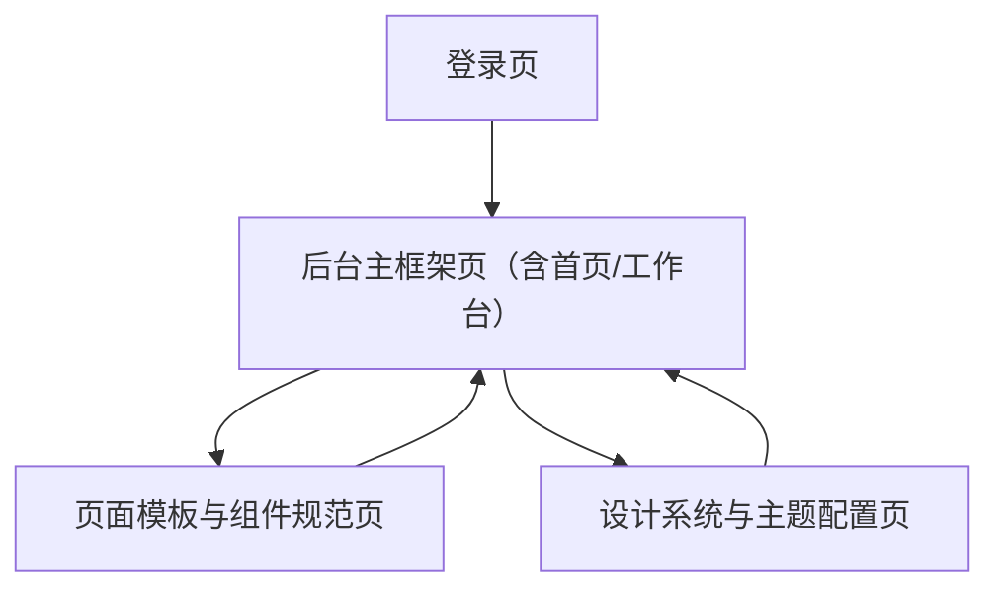

## 1. Product Overview
面向企业级管理后台的 UI/UX 重构方案：统一 Vue3 + Element Plus 技术栈与 Admin Layout，建立统一页面结构与设计系统（间距/圆角/字体/颜色），整体风格参考 Apple 官网的简洁、克制与高留白。

## 2. Core Features

### 2.1 User Roles
| 角色 | 进入方式 | 核心权限 |
|------|----------|----------|
| 后台用户 | 账号密码登录（可对接 SSO） | 访问被授权的菜单与页面 |
| 管理员 | 同上 | 配置菜单/权限、管理主题与全局规范（如有） |

### 2.2 Feature Module
本次重构方案的最小可落地页面与模块如下：
1. **登录页**：账号登录表单、品牌区、错误提示与加载状态。
2. **后台主框架页（含首页/工作台）**：标准 Admin Layout（顶部栏+侧边栏+内容区）、全局导航与面包屑、统一页面容器与状态（空/错/加载）。
3. **页面模板与组件规范页**：列表页模板（筛选/表格/分页）、表单页模板（分组/校验/提交）、详情页模板（摘要/分区信息）、交互与文案规范。
4. **设计系统与主题配置页**：设计 Token（间距/圆角/字体/颜色/阴影）、Element Plus 主题变量映射、组件状态（hover/active/disabled）、可选暗色模式策略。

### 2.3 Page Details
| Page Name | Module Name | Feature description |
|-----------|-------------|---------------------|
| 登录页 | 登录表单 | 提供账号/密码输入与校验；支持回车提交；展示错误与锁定态；登录中禁用按钮 |
| 登录页 | 品牌与引导 | 展示品牌/系统名与一句话说明；提供“忘记密码/联系管理员”等入口（如现有） |
| 后台主框架页（含首页/工作台） | 标准布局骨架 | 提供顶部栏（系统名/用户菜单/快捷入口）+ 左侧菜单 + 主内容区；确保内容区统一 padding 与最大宽度策略 |
| 后台主框架页（含首页/工作台） | 导航体系 | 支持侧边菜单展开/折叠；提供面包屑；菜单与路由保持一致；保留当前页高亮 |
| 后台主框架页（含首页/工作台） | 通用页面状态 | 统一 Loading Skeleton、空状态 Empty、错误页 Error 的展示与占位高度，避免跳动 |
| 页面模板与组件规范页 | 列表页模板 | 定义“筛选区/工具栏/表格区/分页区”固定结构；支持批量操作入口与导出入口（如现有） |
| 页面模板与组件规范页 | 表单页模板 | 定义表单分组与对齐规则；统一校验提示、必填标记、提交/取消按钮区位置与粘性策略 |
| 页面模板与组件规范页 | 详情页模板 | 定义顶部摘要（标题/状态/主操作）与信息分区；支持可复制字段与时间/金额等格式规范 |
| 页面模板与组件规范页 | 交互与文案规范 | 统一按钮优先级（主/次/危险）；统一确认弹窗文案结构；统一 Toast/Message 语气与长度 |
| 设计系统与主题配置页 | 设计 Token | 定义并维护 spacing/radius/typography/color/shadow；明确使用场景与禁用项（如避免过重阴影） |
| 设计系统与主题配置页 | Element Plus 映射 | 将 Token 映射到 Element Plus CSS Variables；定义表格/表单/弹窗/按钮的默认密度与边框策略 |
| 设计系统与主题配置页 | 主题策略 | 提供浅色主题为默认；定义暗色模式是否支持与支持范围（全局/部分组件） |

## 3. Core Process
- 设计系统制定流程：梳理现状 UI → 定义 Token 与组件基线 → 输出页面模板（列表/表单/详情）→ 在示例页验证一致性 → 形成可复用规范。
- 开发落地流程：搭建标准 Admin Layout → 统一路由与菜单结构 → 接入主题变量与全局样式 → 以“模板优先”的方式迁移各业务页面 → QA 以一致性清单验收。
- 迭代与治理流程：新增页面必须基于模板；新增组件需补充规范页与用例；定期回归视觉密度与可读性。

