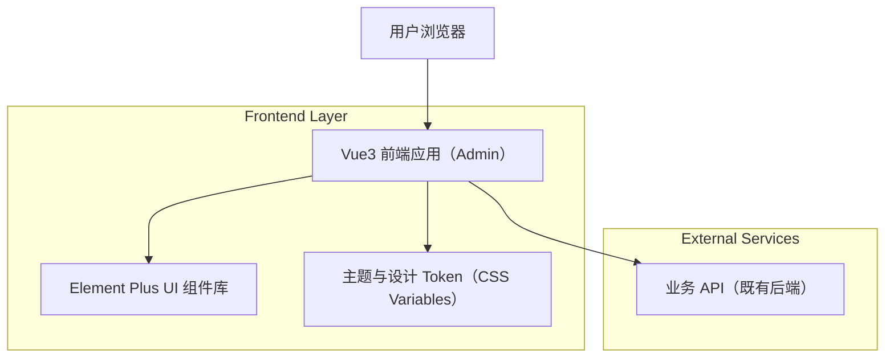

## 1.Architecture design

## 2.Technology Description
- Frontend: Vue@3 + TypeScript + vite
- UI: Element Plus（统一主题变量）
- Routing: vue-router
- State: Pinia（可选，但推荐统一）
- Styling: CSS Variables + SCSS（用于 Token/主题与少量布局封装）
- Backend: None（本方案聚焦前端 UI/UX 与一致性治理；对接既有后端 API）

## 3.Route definitions
| Route | Purpose |
|-------|---------|
| /login | 登录页：认证入口、错误/加载态 |
| / | 后台主框架：承载布局与导航，默认跳转工作台 |
| /dashboard | 首页/工作台：展示概览卡片、常用入口（按现有需求） |
| /guidelines | 页面模板与组件规范：列表/表单/详情模板与用例 |
| /design-system | 设计系统与主题：Token、Element Plus 变量映射、状态规范 |

## 6.Data model(if applicable)
本次 UI/UX 重构不引入新数据库与数据模型。
