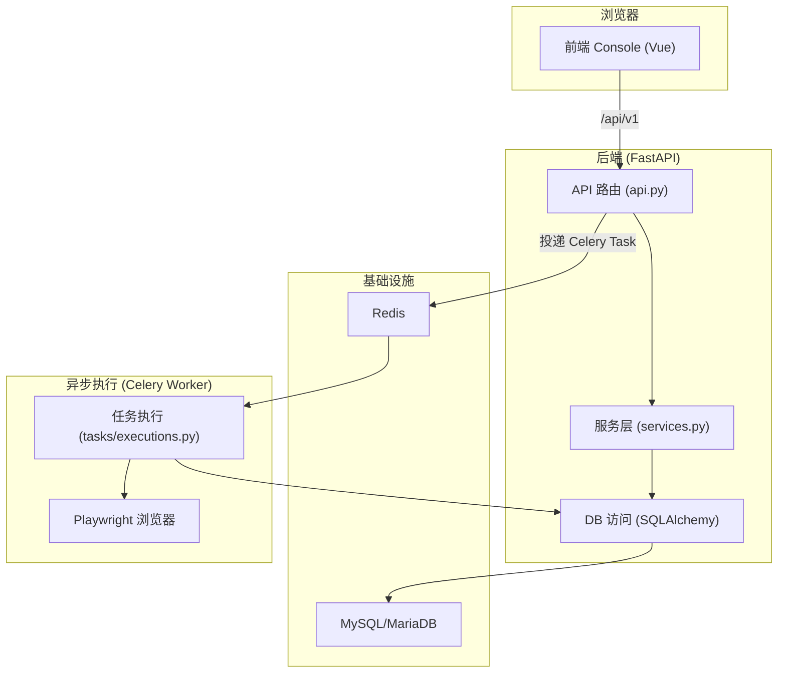
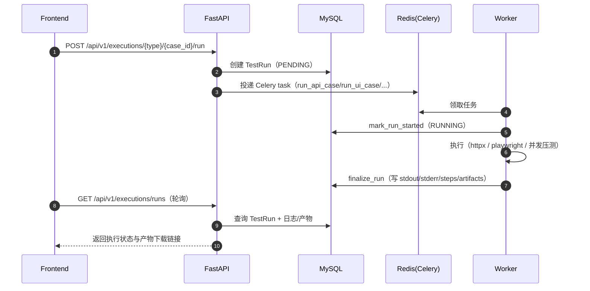

# 01 架构总览

## 系统目标与边界

PPPtest 是一套“测试工程平台示例”，覆盖：

- API 用例管理与执行（同步 / 异步）
- UI 用例管理与执行（Worker 内 Playwright 执行）
- 性能用例管理与执行（并发压测 + 指标判定）
- 测试计划（计划编排、批量执行、报告产出）
- 平台自测（后端 pytest + 前端 e2e Playwright）
- Docker Compose 一键启动与 CloudBase 部署

项目自带一份架构说明：[architecture.md](file:///Users/zhangyongcheng/Desktop/PPPtest/docs/architecture.md)

## 模块分层

## 关键入口

- 后端应用入口：[main.py](file:///Users/zhangyongcheng/Desktop/PPPtest/backend/app/main.py)
  - lifespan 启动时可自动初始化数据库：`bootstrap_runtime()`（见 [main.py:L12-L45](file:///Users/zhangyongcheng/Desktop/PPPtest/backend/app/main.py#L12-L45)）
- 后端 API 聚合： [api.py](file:///Users/zhangyongcheng/Desktop/PPPtest/backend/app/api.py)
  - `public_router`（免登录）与 `protected_router`（强制登录）挂载到 `/api/v1`（见 [main.py:L43-L45](file:///Users/zhangyongcheng/Desktop/PPPtest/backend/app/main.py#L43-L45)、[api.py:L692-L704](file:///Users/zhangyongcheng/Desktop/PPPtest/backend/app/api.py#L692-L704)）
- Worker（Celery）入口： [celery_app.py](file:///Users/zhangyongcheng/Desktop/PPPtest/backend/app/core/celery_app.py)
  - imports 注册：`("app.tasks.executions", "app.tasks.case_generation")`（见 [celery_app.py:L12-L18](file:///Users/zhangyongcheng/Desktop/PPPtest/backend/app/core/celery_app.py#L12-L18)）
- Worker 执行逻辑： [executions.py](file:///Users/zhangyongcheng/Desktop/PPPtest/backend/app/tasks/executions.py)
  - 任务定义：`run_api_case/run_ui_case/run_performance_case/run_test_plan`（见 [executions.py:L953-L1253](file:///Users/zhangyongcheng/Desktop/PPPtest/backend/app/tasks/executions.py#L953-L1253)）
- 前端入口： [main.js](file:///Users/zhangyongcheng/Desktop/PPPtest/frontend/src/main.js) + [router/index.js](file:///Users/zhangyongcheng/Desktop/PPPtest/frontend/src/router/index.js)
- Compose 一键启动： [docker-compose.yml](file:///Users/zhangyongcheng/Desktop/PPPtest/docker-compose.yml)

## 主链路（从点击“执行”到产出结果）

## 依赖关系（代码层）

- `backend/app/main.py` 依赖 `app.api`（路由）、`app.services`（启动初始化）、`app.core.config`（配置）
- `backend/app/api.py` 依赖：
  - `app.schemas`（请求/响应模型）
  - `app.services`（鉴权、初始化、执行落库、工具能力等）
  - `app.core.database.get_db`（DB Session）
  - `app.core.celery_app.celery_app` 与 `app.tasks.*`（任务分发/执行）
  - `app.models`（ORM 实体）
- `backend/app/tasks/executions.py` 依赖：
  - `SessionLocal`（独立 DB Session）
  - `playwright` / `httpx`（执行引擎）
  - `services.mark_run_started/finalize_run`（统一状态流转与产物同步）
- `frontend/src/lib/api.js` 依赖浏览器 `fetch` 与 `localStorage` token（见 [api.js:L64-L120](file:///Users/zhangyongcheng/Desktop/PPPtest/frontend/src/lib/api.js#L64-L120)）

